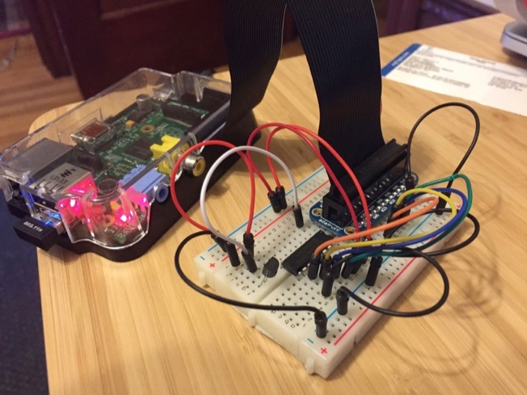
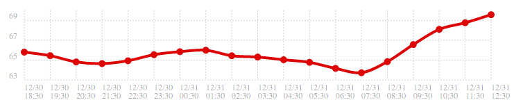

# Raspberry Pi Temperature Monitor

Running on a revision 1 Raspberry Pi Model B with the base Raspian install.

## Setup

* `apt-get install ruby2.1-dev sqlite3 libsqlite3-dev`
* `gem install bundler`
* `bundle install`

## Running

I have this running as two separate processes that I kick off manually. I use
tmux for this.

* `bundle exec ruby main.rb` - Polls the thermometer every 30 seconds and
  records the result in a SQLite3 database.
* `bundle exec ruby web.rb` - Runs a web app that provides stats from the
  database.

